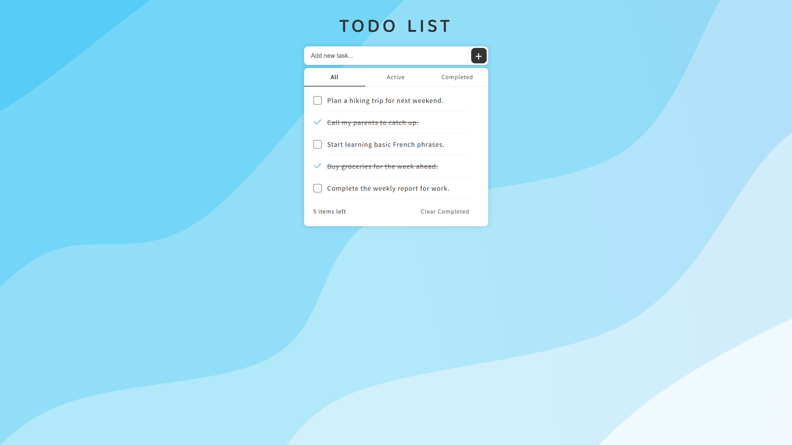

# Todo List

This is a simple Todo List application built using React. It allows users to add, remove, and toggle the completion status of their tasks. Additionally, users can filter tasks based on their completion status.

Demo: https://sky9154.com/TodoList

### Features

- **Add Todo**: Users can add new tasks to the list by typing in the input field and pressing enter.

- **Toggle Completion**: Clicking on a task toggles its completion status.

- **Filter Todos**: Users can filter tasks based on their completion status (all, active, completed).

- **Clear Completed**: Users can clear all completed tasks from the list with a single click.

- **Local Storage**: Todos are persisted in the browser's local storage, so they are not lost when the page is refreshed.

### Technologies Used

- React: JavaScript library for building user interfaces.

- TypeScript: Provides type-checking capabilities to JavaScript.

- HTML/CSS: Markup and styling for the application.

- Local Storage API: Used to persist todo data in the browser.

### Folder Structure
- **src**: Contains the source code of the application.

    - **components**: Contains React components, including `Content`, `Header`, and `Input`.

    - **App.tsx**: Main entry point of the application.

    - **index.tsx**: Renders the root React component into the DOM.
    - **style.css**: Styles for the application.

### License

This project is licensed under the MIT License - see the [LICENSE](LICENSE) file for details.
